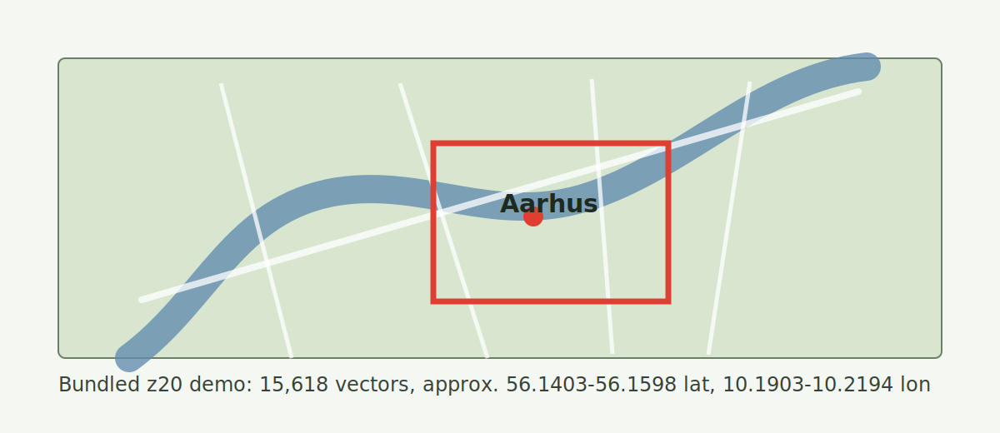

# Sat2Geo Aarhus

**Satellite/map crop to WGS84 coordinates with DINOv2 embeddings and Faiss search.**

Sat2Geo Aarhus is a small open-source geolocalization demo: give it a satellite-map image crop from the bundled Aarhus coverage area, and it returns likely latitude/longitude coordinates.



This repo intentionally ships only an Aarhus demo index. To locate images across all of France, Denmark, or another large region, users must build a larger searchable database first.

Important: code and imagery are separate. Before publishing a public GitHub repo with bundled chips/indexes, confirm that your imagery license allows redistribution. See [DATA_NOTICE.md](DATA_NOTICE.md).

## What It Does

- Encodes a query image with `facebook/dinov2-base`.
- Searches a local Faiss vector index of georeferenced satellite chips.
- Returns top coordinate candidates and a fused best estimate.
- Includes scripts to build your own database from GeoTIFF/XYZ satellite tiles.
- Includes a tiny Tkinter GUI that can be packaged as a Windows EXE.

## Demo Coverage

The bundled index covers part of Aarhus, Denmark at zoom level 20:

```text
lat: 56.1402891 to 56.1597954
lon: 10.1903350 to 10.2194316
chips/vectors: 15,618
chip size: 256 px
overlap: 64 px
```

Images outside this area will still return the nearest match, but the result will not be meaningful.

See [DATASET.md](DATASET.md) for the bundled dataset stats.

## Quick Start

```powershell
git clone https://github.com/YOURNAME/sat2geo-aarhus.git
cd sat2geo-aarhus
python -m venv .venv
.\.venv\Scripts\Activate.ps1
python -m pip install -r requirements.txt
```

Run a demo query:

```powershell
python -m sat2geo examples/query_aarhus_01.jpg
```

Expected output shape:

```text
Top matches:
01. coords="56.1585048, 10.1918799" score=0.791524 chip_id=1033 ...

Best coordinate:
coords="56.1585048, 10.1918799"
https://www.google.com/maps?q=56.1585048,10.1918799
```

## GUI

```powershell
python sat2geo_gui.py
```

Choose an image from `examples/` or another crop inside the Aarhus coverage area, then press **Locate**.

## Build a Windows EXE

```powershell
python -m pip install -r requirements-gui.txt
.\scripts\build_exe.ps1
```

The clickable app appears at `dist\Sat2Geo-Aarhus\Sat2Geo-Aarhus.exe`.

See [docs/EXE.md](docs/EXE.md) for details.

## Build Your Own Region

Sat2Geo is only as broad as the local database you build. A country-scale locator requires a country-scale satellite index.

Basic pipeline for a zoom-20 Aarhus-style build:

```powershell
python scripts/download_tiles.py --west 10.1905 --south 56.1402 --east 10.2194 --north 56.1598 --zoom 20 --out data/raw/aarhus_z20.tif
python scripts/chip_tiles.py --input-dir data/raw --chips-dir data/chips --db-path data/index/chips.sqlite
python scripts/embed_tiles.py --db-path data/index/chips.sqlite --embeddings-path data/embeddings/chip_embeddings.npy --ids-path data/embeddings/chip_ids.npy
python scripts/build_faiss_index.py --embeddings-path data/embeddings/chip_embeddings.npy --ids-path data/embeddings/chip_ids.npy --index-path data/index/chips_faiss.index
python -m sat2geo path\to\query.jpg
```

For France-scale or Denmark-scale work, read [docs/BUILDING_A_DATABASE.md](docs/BUILDING_A_DATABASE.md).

## Repository Layout

```text
sat2geo/
  locator.py              reusable Python locator
  cli.py                  command-line interface
scripts/
  download_tiles.py       XYZ tiles -> GeoTIFF
  chip_tiles.py           GeoTIFF -> overlapping chips + SQLite metadata
  embed_tiles.py          chips -> DINOv2 embeddings
  build_faiss_index.py    embeddings -> Faiss index
data/
  chips/                  bundled Aarhus demo chips
  index/                  bundled SQLite metadata + Faiss index
  embeddings/             bundled full embeddings for reranking
examples/                 query images for the Aarhus demo
docs/                     build and scaling notes
```

## Limitations

- This is visual retrieval, not magic global geolocation.
- The bundled dataset is Aarhus-only.
- Results depend on image style, zoom, season, rotation, cropping, and imagery provider.
- The included downloader uses an XYZ tile URL template. Respect provider terms and prefer open data for redistributable datasets.
- Raw GeoTIFFs are not committed because they are large.

## Technical Name

The short project name is **Sat2Geo Aarhus**. A more academic description is:

> Local aerial-image geolocalization via self-supervised vision embeddings and approximate nearest-neighbor search.

## License

Code is MIT licensed. Check imagery/data provider licenses before redistributing derived image chips or indexes.
